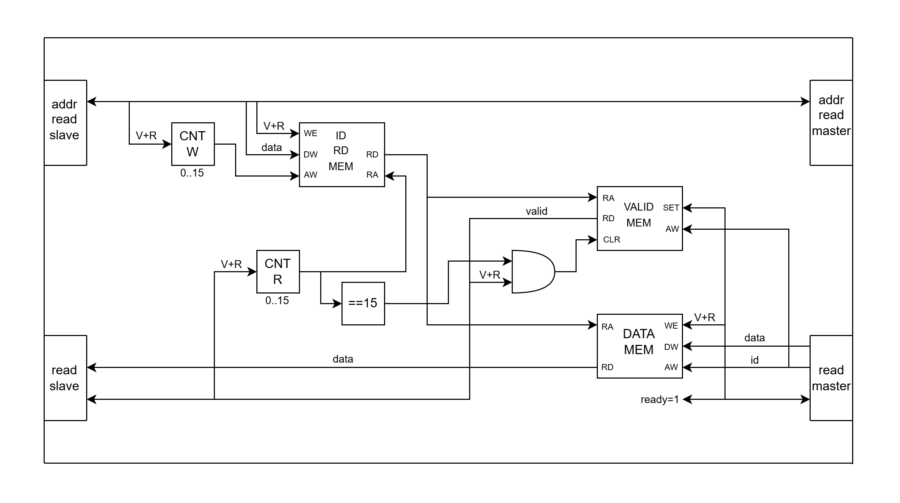

# Reorder buffer

## Структура репозитория

- rtl - директория, содержащая исходные файлы
- tb - директория, содержащая тестовые окружения
- img - директория, содержащая картинки для readme
- README.md - вся информация, сопровождающая блок

## Описание микроархитектуры устройства

### Структурная схема

Ниже приведена структурная схема разработанного устройства.

  

> На структурной схеме присутствует обозначение `V+R`, это краткая запись `valid && ready` на любой из шин.  

### Описание функционала используемых модулей

В составе данного устройства используются следующие модули:

1. **Память порядка ID (ID MEM)** - модуль памяти, которая хранит в себе ID транзакций с slave-интерфейса в требуемом порядке.  
2. **Память корректности ID (VALID ID MEM)** - модуль памяти, которая хранит информациюю о валидности значений ID, хранящихся в памяти порядка ID (ID MEM).
3. **Счётчик записи порядка ID (CNT W)** - модуль инкрементирующегося счётчика, отвечает за адрес записи в память порядка ID (ID MEM) и память корректности ID (VALID ID MEM).  
4. **Память данных (DATA MEM)** - модуль памяти, которая хранит данные, полученные с транзакций master_read-интерфейса.  
5. **Память корректности данных (VALID DATA MEM)** - модуль памяти, которая хранит информацию о валидности данных, находящихся в памяти данных (DATA MEM).  
6. **Счётчик чтения данных (CNT R)** - модуль инкрементирующегося счётчика, отвечает за чтение ID из памяти порядка ID (ID MEM) и его выставление на интерфейс read slave.

### Алгоритм работы

> В тексте будут использоваться сокращенные названия интерфейсов: ARS - address read slave, ARM - address read master, RS - read slave, RM - read master.  

До начала работы на схему подаётся сигнал сброс (активный низкий уровень), который сбрасывает VALID ID MEM и VALID DATA MEM в нули. Также сбрасывается в нуль счётчики чтения и записи CNT R и CNT W.  

В начале работы модуля начинается передача запросов ID от ARS к ARM. При этом при каждом хэндшейке запрашиваемый ID записывается в память ID MEM, а счётчик CNT W (выполняет роль указателя записи) инкрементируется. Параллельно в память VALID ID MEM записывается единица, что указывает на валидность данных по данному адресу.  

Параллельно описанным выше процессам (в общем случае) на интерфейс RM начинают поступать пары данных ID-DATA (порядок пар ID-DATA может не соответствовать порядку, в котором данные запрашивались), поэтому на интерфейс RM всегда подаётся активный уровень сигнала `ready` (для буферизации данных). Поступающие данные записываются в память данных DATA MEM, а так же устанавливается значение в памяти валидности VALID DATA MEM. При этом, пара ID-DATA превращается просто в DATA (ID хранится неявно, в виде адреса записи).  

Счётчик чтения CNT R инкрементируется только в случае хэндшейка на интерфейсе RS. На интерфейс RS статично подаётся ID транзакции из памяти ID MEM и данные из памяти DATA MEM. Сигнал `valid` выставялется в высокий уровень только в случае, если ID транзакции в памяти ID MEM корректный и данные в памяти DATA MEM корректные, информация об их корректности берётся из VALID ID MEM и VALID DATA MEM соответственно. В случае хэндшейка интерфейс RS захватывает корректные данные, а счётчик CNT R инкрементируется.  

Когда происходит передача последней порции данных на интерфейс RS (то есть счётчик инкрементируется со значения 15, переполняется и уходит в 0) памяти валидности VALID ID MEM и VALID DATA MEM обнуляются, таким образом эти данные не будут ошибочно приняты за корректные при обработке следующих 16 транзакций. Модуль снова готов к работе.  

### Детали реализации отдельных модулей и устройства в целом

#### Детали реализации устройства в целом

По сути весь дизайн сводится к тому, что необходимо запоминать два набора информации:

1. Требуемый порядок отправки пар ID-DATA.
2. Данные с интерфейса RM для их дальнейшего переупорядочивания.

В данном дизайне используется следующий набор правил, которые позволяют получить понятную логику:

1. В память ID MEM данные записываются последовательно по ячейкам, при этом внутри каждой ячейки содержится ID транзакции. Таким образом если последовательно пробежаться по всем ячейкам от 0 до 15, то можно получить требуемый порядок выдачи данных.
2. Данные с интерфейса RM записываются в память по адресу, соответствующему их ID. Таким образом, подав на адресный вход памяти ID транзакции можно получить соответствующие данному ID данные.
3. Счётчик чтения CNT R является инкрементирующим, т.е. увеличивает своё значение на единицу. Таким образом он пробегает по всем адресам памяти ID MEM и получает ID транзакций в правильном порядке (пункт 1), этот правильный порядок направляется на адресный вход памяти данных DATA MEM и на выходе получаются соответствующие данному ID данные (пункт 2). Собирая вместе этот адрес и данные из памяти получается требуемая пара ID-DATA в правильном порядке.

Также, что не упоминалось в трёх правилах просто дизайна, но также необходимо для работы это специальный модуль памяти `valid_mem`, который будет приставлен к каждому из модулей памяти (ID MEM, DATA MEM) и будет хранить информацию о валидности этих самых данных в памяти.

В любой момент времени находятся какие-то данные в паре ID-DATA и необходимо понимать, в какой момент они корректные и можно выставлять сигнал `valid` на интерфейс RS. В данном дизайне данные на выходе считаются корректными, когда в памяти ID MEM находится корректный адрес, а по этому адресу в памяти данных DATA MEM находятся корректные данные.

Это необходимая мера, спасающая от ситуаций, при которых устройство будет передавать данные, оставленные в памяти при обработке предыдущих 16 транзакций или неопределенные данные после включения.  

#### Детали реализации отдельных модулей

##### Детали реализации модуля `valid_mem`

Модуль `valid_mem` представляет из себя регистровую память, хранящую 16 бит (4-битный адрес), ровно как и уникальных значений ID.

Применительно к данному дизайну, каждый адрес соответсвует одному биту данных, который сигнализирует о валидности/невалидности данных в основном модуле памяти, это достигается за счёт того, что при записи в основную память по такому же адресу в `valid_mem` записывается единица, что сигнализирует о том, что по данному адресу были записаны корректные данные.

Сброс памяти, помимо сигнала `rst_n` осуществляется с помощью сигнала `clear`, при высоком логическом уровне синхронно все ячейки памяти сбрасываются в нуль. Именно этот механизм не позволяет использовать данные с прошлой обработки данных на следующей, т.к. они признаются недействительными.  

##### Детали реализации модуля `mem_2ps`

Модуль `mem_2ps` представляет из себя стандартную простую двупортовую память (один порт на чтение, один на запись), однако обладающую (в данной реализации) асинхронным чтением (об этом будет в разделе _потенциальные оптимизации_).

Модуль является параметризуемым и в обоих инстансах использует 4-битную ширину адреса, однако память ID MEM имеет ширину данных 4 бита (т.к. хранит ID, он же адрес памяти DATA MEM), а память DATA MEM имеет ширину, соответствующую значению параметра `DATA_WIDTH` модуля верхнего уровня.

## Принятые условности и ограничения устройства

При проектировании модуля предполагалось, что после запроса 16 транзакции с интерфейса ARS до полной выдачи их на интерфейс RS новые данные поступать не будут.  
В противном случае возможно следующее решение: создание счётчика, который будет считать хэндшейки на интерфейсе RS, до моменты пока их не будет равно 16 сигнал `ready` на интерфейсе ARS принудительно принимает низкий логический уровень (независимо от показания сигнала `ready` на интерфейсе ARM).  

## Оценка производительности и задержка (latency)

В идеальном случае, когда порядок пар ID-DATA на интерфейсе RM соответсвует порядку запроса ID на интерфейсе ARM задержка будет составлять 1 такт, так как в текущей реализации в любом случае требуется запись в память данных DATA MEM (об этом будет в разделе _потенциальные оптимизации_).  
В случаях отличных от идеального, данные будут задерживаться на время, пока на интерфейсе RM не появится пара ID-DATA со значение ID соответствующим следующему запрошенному по интерфейсу ARM.  

## Потенциальные оптимизации

### Байпасс корректных ID

Данная оптимизация предполагает, что в случае, когда на интерфейсе RM появляется пара ID-DATA со значением ID соответствующим тому, которое требуется отправить на интерфейс RS следующим, можно не записывать данные в память DATA_MEM а направлять напрямую на линию данных.  

Реализация данной оптимизации занимает один мультиплексор на линии данных интерфейса RS, который будет выбирать читать из памяти DATA MEM или напрямую с интерфейса RM и логику его управления, которая будет сравнивать запрашиваемый ID и ID текущей транзакции на интерфейсе RM. Также изменения потребует логика, отвечающая за сигнал `valid` на интерфейсе RS, т.к. в текущей реализации она заточена только под работу с промежуточной памятью (DATA MEM).  

Потенциальный выигрыш: уменьшение задержки на 1 такт для каждой транзакции.  
Потенциальные потери: незначительное увеличение утилизации.  

### Использование BRAM

Как говорилось в пункте _Детали реализации отдельных модулей_, памяти ID MEM и DATA MEM являются эксземплярами одного модуля `mem_2ps`, реализующего двупортовую регистровую память с асинхронным чтением.  
Регистровая память с асинхронным чтением была выбрана с целью уменьшения задержки. Утилизация ресурсов FPGA при небольших значения параметра `DATA_WIDTH` остаётся разумной.  
В случаях больших значений параметра `DATA_WIDTH` предлагается заменить регистровую память DATA MEM на BRAM, что уменьшит утилизацию LUT и Slice-регистров, однако привнесёт один такт задержки из-за синхронного чтения, а также, наиболее вероятно, увеличит задержку пути.  
Целесообразность данной оптимизации зависит от значения параметра `DATA_WIDTH` и доступности ресурсов FPGA.  

Потенциальный выигрыш: уменьшение утилизации LUT и Slice-регистров.  
Потенциальный проигрыш: увеличение задержки для данных на такт, увеличение критического пути.  

## Тестовое окружение

> Тестовое окружение находится по пути `tb/reorder_buffer_tb.sv`.  

Тестирование модуля производилось с использованием симулятора xsim (Vivado Simulator 2019.1).  

### Параметры

Для свободного изменения предоставлены следующие параметры.

Параметры запуска тестов:  
`RANDOM_SEED` - ключ генерации случайных чисел (псевдо).  
`TEST_ITERATIONS` - количество итераций тестовых значений (одна итеарция - передача 16 запросов и получение 16 ответов соответственно).  

Параметры, влияющие на работу тестового окружения:  
`SEND_MAX_DELAY` - максимальная задержка между выставлением валидных данных на интерфейс `ARS`.  
`BACK_MAX_DELAY` - максимальная задержка между попытками выставления данных на интерфейс `RM`.  

> Именно _попытками выставления_, т.к. возможна ситуация, когда интерфейс ARM ещё не принял ни один запрос.  

Параметры модуля DUT:  
`DATA_WIDTH` - ширина данных самого модуля.  

### Принцип работы

Главный цикл тестового окружения выглядит следующим образом:

```sv
repeat(TEST_ITERATIONS) begin
  ids_send_order.shuffle();
  ids_back_order.shuffle();
  i = 0;
  k = 0;
  clear_gotten_ids = 1;
  repeat(2) @( posedge clk );
  clear_gotten_ids = 0;
  fork
    send_all_ids();
    send_all_data_back();
  join
  wait ( goto_next_data );
  @( posedge clk );
end
```

Код в главном цикле выполняется `TEST_ITERATIONS`, в нём случайным образом перемешиваются порядок запроса ID на интерфейсе ARS и выдачи на интерфейс RM. Далее, параллельно запускаются функция выставляющая запрос на интерфейс ARS и функция, считывающая запросы с интерфейса ARM и выставляющая перемешанные пары ID-DATA на интерфейс RM.

В обработчике интерфейса RS присутствует следующий блок кода:

```sv
if ( t == 16 ) begin
  $display("Correct order : %p", ids_send_order);
  $display("Gotten ids    : %p", ids_collected_order);
  $display("Gotten data   : %p\n", data_collected_order);
  if ( ids_send_order != ids_collected_order ) begin
    $display("Test failed!");
    $stop();
  end
  t = 0;
  goto_next_data = 1;
end
```

Данный блок кода сравнивает правильный порядок и требуемый, если всё в порядке, то происходит переход на следующую итерацию, в противном случае, появляется сообщение об ошибке и симуляция останавливается.  

> Для удобства отладки, в паре ID-DATA, значение данных всегда равно значение ID + `'d10`.  

## Метрики дизайна на FPGA

Для снятие метрик использовался САПР **Vivado 2019.1**, была выбрана плата `xc7a100tcsg324-1`.  

### Утилизация

Ниже приведена таблица с утилизацией ресурсов (LUT и FF) для различных значений параметра `DATA_WIDTH`.

| DATA_WIDTH | LUT, unit | FF, unit | LUT, % | FF, % |
|------------|-----------|----------|--------|-------|
| 8          | 62        | 40       | 0.1    | 0.03  |
| 32         | 78        | 40       | 0.12   | 0.03  |
| 64         | 98        | 40       | 0.15   | 0.03  |
| 256*       | 226       | 40       | 0.35   | 0.03  |
| 1024*      | 738       | 40       | 1.13   | 0.03  |

> \* - метрики после синтеза.

### Максимальная частота

Максимальная частота была рассчитана по формуле ниже с использованием slack, полученного при имплементации модуля со значением параметра `DATA_WIDTH` равным 8.  

$
f_{max}=\frac{1}{(T_{clk}-Slack)}=\frac{10^9}{10-4.5}=180 МГц
$  

Максимальная частота работы модуля для данной платы составила 180 МГц.  

> Для значений параметра `DATA_WIDTH` slack отличается незначительно.  
