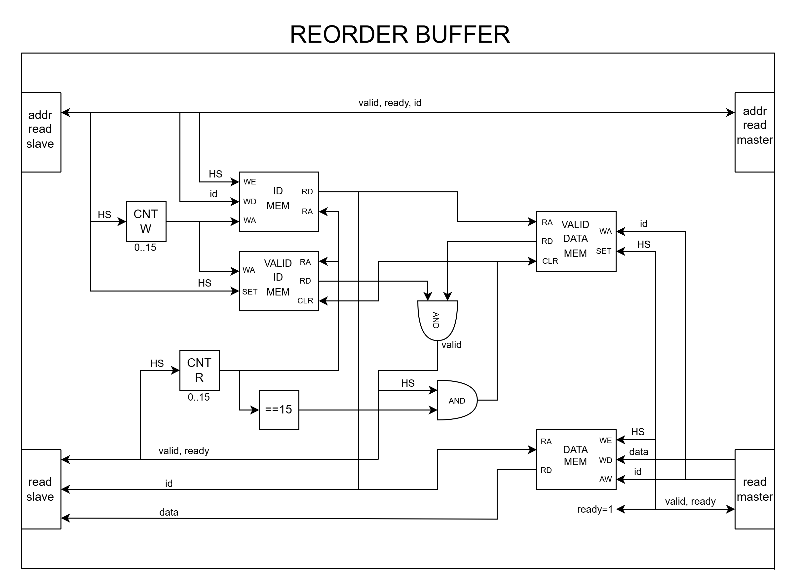

# Reorder buffer

## Структура репозитория

- rtl - директория, содержащая исходные файлы
- tb - директория, содержащая тестовые окружения
- img - директория, содержащая картинки для readme
- README.md - вся информация, сопровождающая блок

## Описание микроархитектуры устройства

### Структурная схема

Ниже приведена структурная схема разработанного устройства.

  

### Описание используемых модулей

В составе данного устройства используются следующие модули:

1. **Память порядка ID (ID RD MEM)** - модуль памяти, который хранит в себе ID транзакций с slave-интерфейса в требуемом порядке.  
2. **Счётчик записи порядка ID (CNT W)** - модуль инкрементирующегося счётчика, отвечает за адрес записи в память порядка ID (ID MEM).  
3. **Память данных (DATA MEM)** - модуль памяти, который хранит данные, пришедшие с транзакций master-интерфейса.  
4. **Память корректности данных (VALID MEM)** - модуль (регистровой) памяти, которая хранит информацию о валидности данных, находящихся в памяти данных (DATA MEM).  
5. **Счётчик чтения данных (CNT R)** - модуль инкрементирующегося счётчика, отвечает за чтение данных из памяти данных (DATA MEM) и их высталение на интерфейс read slave.

### Алгоритм работы

TODO

## Принятые условности и ограничения устройства

TODO

TODO

## Потенциальные оптимизации

TODO
bypass
bram (утилизация)

## Тестовое окружение

TODO

## Метрики дизайна на FPGA

TODO

### Утилизация

TODO

### Максимальная частота

TODO

## Ход мыслей при проектировании

TODO
